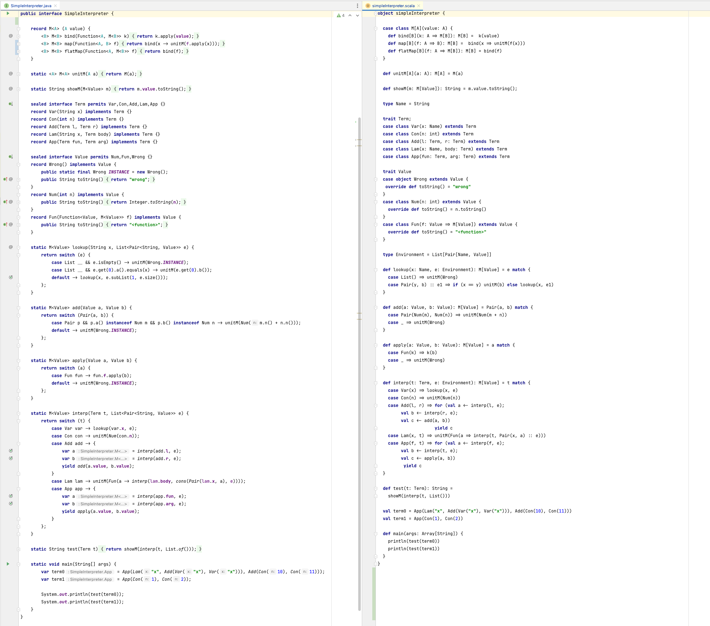

# Java Getting Closer to Scala’s Expressiveness

Java will never be as expressive as Scala. Scala’s feature set allows for writing complete DSLs as well as concise, 
terse code. That said, Java is getting closer. Since JDK 14 Java has had preview support for “records” which are similar 
to Scala’s case classes. In future JDKs records will have near feature parity with Scala’s case classes.

## The Example

For me, the most expressive feature of Scala is its case classes with pattern matching. Once you’ve coded with this 
feature you’ll never want to return to the alternatives. This repo shows Java’s progress towards equalling Scala’s 
case class feature. It’s unlikely that Java will ever completely match Scala but it will get close.

Shown here is a very old interpreter from the [Scala examples website](https://www.scala-lang.org/old/node/56.html). It’s 
not meant to represent current idiomatic Scala nor is it meant to be a definitive example. However, it’s simple, fits on one 
page and shows the expressiveness of case classes.

Three Java attempts are shown. Versions in Java 15 and 17 taking advantage of records and Java's initial support for pattern matching. The other in Java 8.

## Java 19 Attempt

Record patterns are now available and the Java version is nearly identical to the Scala version. Record patterns
are limited to type comparison and extraction and so can't match on, for example, empty-list but that's aboout
the only feature missing. Java is still more verbose (the need for `var` for example) but it's very impressive
how close it now is. Java, of course, is still missing a built-in `Pair` syntax for list head/tail, etc.

## Java 17 Attempt

Java records are now part of the language. My [RecordBuilder library](https://github.com/Randgalt/record-builder) is still used for some builder sugar. Huge
kudos to [Gavin Ray](https://github.com/GavinRay97) for contributing the Java 17
version using Sealed Classes as well as Pattern Matching for Switch. This is
getting very, very close to the Scala version now. Once deconstruction is added
we'll have a nearly exact version.

Java 17's enhanced pattern matching for switch is missing reification and deconstruction. So, for now,
a combination of the current pattern-matching-for `switch` with an extra pattern match for `instanceof` is used. 

See the Java 15 attempt for what will be permanent issues with lack of a `Pair`
and type aliasing.

## Java 15 Attempt

[Java 15’s Records](https://openjdk.java.net/jeps/359) are an interim feature towards full pattern matching and 
deconstruction. Java’s records are very close to Scala’s case classes (sans pattern matching/deconstruction which 
will come later). The only missing feature is a static constructor/builder method which makes allocating case 
classes a bit cleaner (no need for `new`). Fortunately, my [RecordBuilder library](https://github.com/Randgalt/record-builder) 
can auto-generate these so I’ve used it here to match Scala.

The major thing missing in this Java 15 attempt is, of course, Scala’s case-match. Future versions of Java will 
add support for something similar but for now I’ve had to use Java 15’s [new pattern matching for instanceof](https://openjdk.java.net/jeps/375).

Java 15 is also missing a built-in Pair class. With records, however, this is very easy to create. Java also does 
not support type aliases. It’s unlikely Java will add support for this. Thus, the Scala example’s `Environment` and `Name` 
cannot be duplicated.

These caveats aside, the Java 15 attempt is not too bad. Once we get Java’s version of pattern matching it will be possible 
to write a near perfect duplication of this Scala example.

## Java 8 Attempt

Java 8, of course, does not support anything like records or case classes. However, we can use 
generators such as [Immutables](https://immutables.github.io) to generate something close to a record. 
Having to use Java interfaces as a spec for the Immutables builder is not as satisfying and makes the 
code much more verbose. Also, the Immutables builder does not generate static constructors/builders so these 
have to be added manually.

Like in the Java 15 example, there is no built-in Pair class and in this Java 8 instance it has to be 
specified as an interface so that Immutables can generate the implementation.

Lastly, Java 8 does not have Java 15’s pattern matching for instanceof so extra work in the form of 
casts must be done in the parts of the code that match on operation types.

## Links

- Original Scala Example: [Scala SimpleInterpreter](https://www.scala-lang.org/old/node/56.html)
- Java 17 Attempt: [Java 17 SimpleInterpreter](https://github.com/Randgalt/expressive-java/blob/master/java-17/src/main/java/examples/SimpleInterpreter.java#L17)
- Java 15 Attempt: [Java 15 SimpleInterpreter](https://github.com/Randgalt/expressive-java/blob/master/java-15/src/main/java/examples/SimpleInterpreter.java#L17)
- Java 8 Attempt: [Java 8 SimpleInterpreter](https://github.com/Randgalt/expressive-java/blob/master/java-8/src/main/java/examples/SimpleInterpreter.java#L9)
- Helpers:
  - Java 19:
    - [Helpers.java](https://github.com/Randgalt/expressive-java/blob/master/java-19/src/main/java/examples/Helpers.java)
    - [Pair.java](https://github.com/Randgalt/expressive-java/blob/master/java-19/src/main/java/examples/Pair.java)
  - Java 17:
    - [Helpers.java](https://github.com/Randgalt/expressive-java/blob/master/java-17/src/main/java/examples/Helpers.java)
    - [Pair.java](https://github.com/Randgalt/expressive-java/blob/master/java-17/src/main/java/examples/Pair.java)
  - Java 15:
    - [Helpers.java](https://github.com/Randgalt/expressive-java/blob/master/java-15/src/main/java/examples/Helpers.java)
    - [Pair.java](https://github.com/Randgalt/expressive-java/blob/master/java-15/src/main/java/examples/Pair.java)
  - Java 8:
    - [Helpers.java](https://github.com/Randgalt/expressive-java/blob/master/java-8/src/main/java/examples/Helpers.java)
    - [Pair.java](https://github.com/Randgalt/expressive-java/blob/master/java-8/src/main/java/examples/Pair.java)

## Building/Running

- Make sure Javas 8, 15, 17 and 19 are installed as well as [jenv](https://www.jenv.be)
- Make sure a recent version of [Maven](https://maven.apache.org) is installed
- From the root directory run `./run.sh`

